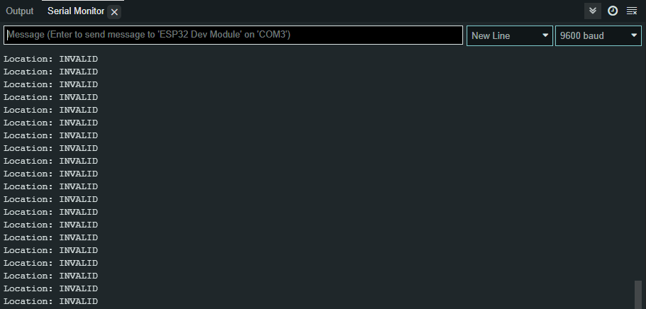
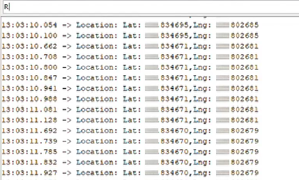

# Google_Maps_ESP32_GPS_Neo_6m
Getting Google Maps position link using GPS Neo Ublox 6m with ESP32 development board.

# Wiring Diagram

# Notes
You need to install TinyGpsPlus library first to your arduino IDE.  
You can add it by copying the TinyGPSPlus folder to your arduino IDE library.  
The common path is C:\Users\<username>\Documents\Arduino\libraries

# Output Example
# No Satellite

# Satellite available

